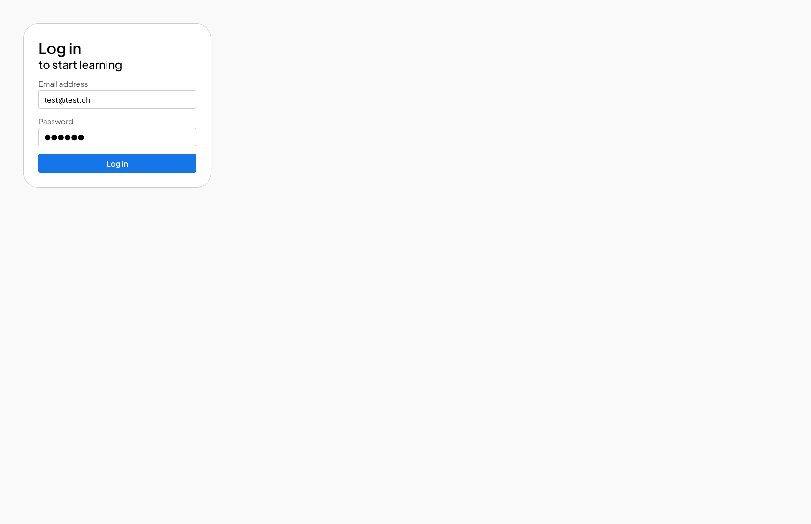

# Exercice hebdomadaire 7

## Installation

1. Cloner le repository
2. Ouvrir le dossier avec Visual Studio Code
3. Ouvrir une fenêtre de terminal dans Visual Studio Code et entrer la commande suivante :

```bash
npm install
```

## Travail

Depuis le terminal, entrer la commande suivante :

```bash
npm run dev
```

## Consigne

1. Ouvrir [la maquette Figma](https://www.figma.com/design/aMAVBsgPEeenifCKQFn2Mj/imd2-exercice-hebdomadaire-7?node-id=0-1&m=dev) dans l'équipe de votre année
2. Intégrer la maquette aussi précisément que possible, en reprenant les propriétés de Figma
3. Faire un commit, puis un push

☝️ Le html est déjà présent dans index.html. Il n'y a pas besoin de le modifier.

☝️ Reproduisez l'effet au survol sur le bouton d'envoi, ainsi que l'effet au focus sur les champs texte (pseudo-classe :focus). Vous pouvez voir les effets depuis le prototype.

## Aperçu de la maquette


